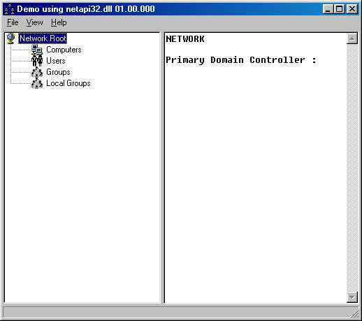



## netapi32\_dll\_Examples

### Description

This example (which should be under VisualBASIC but has ended up in the wrong section - apoligies) demonstrates a number of API calls available from

netapi32.dll which can get all the workstations, users, groups and

local groups from a domain and provide extensive information on each

entity. The code could form the basis for developing a domain management or

monitoring package. Some of the API calls that are demonstrated include: -

NetGetDCName, NetUserGetInfo, NetGroupEnum, NetSessionEnum, NetGroupGetUsers, NetLocalGroupEnum, NetLocalGroupGetMembers, NetServerEnum, NetShareEnum, NetUserEnum, NetWkstaUserEnum
 
### More Info
 

             |
---                |---
**Submitted On**   |2003-01-19 13:54:44
**By**             |[Gordon Wilmot](https://github.com/Planet-Source-Code/PSCIndex/blob/master/ByAuthor/gordon-wilmot.md)
**Level**          |Intermediate
**User Rating**    |4.8 (24 globes from 5 users)
**Compatibility**  |VB 4\.0 \(32\-bit\), VB 5\.0, VB 6\.0
**Category**       |[Miscellaneous](https://github.com/Planet-Source-Code/PSCIndex/blob/master/ByCategory/miscellaneous__1-1.md)
**World**          |[Visual Basic](https://github.com/Planet-Source-Code/PSCIndex/blob/master/ByWorld/visual-basic.md)
**Archive File**   |[netapi32\_d1536831302003\.zip](https://github.com/Planet-Source-Code/gordon-wilmot-netapi32-dll-examples__1-42817/archive/master.zip)

